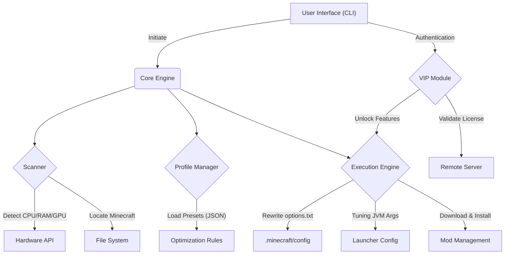

# Optism-CLI


[](https://www.buymeacoffee.com/yourusername)

Minecraftの実行環境をハードウェアレベルで解析し、パフォーマンスを極限まで引き出すための次世代最適化エンジン。

---

## 📊 System Architecture

Optism-CLIは、以下のコンポーネントで構成される疎結合なアーキテクチャを採用しています。



---

## ⚙️ Core Logic: Hardware Analysis

Optism-CLIは、実行環境のCPU/RAMを動的に評価します。AIを使わず、純粋な条件分岐（If-Then）で実装されています。

```go
// pkg/scanner/mem_calc.go

func CalculateMemory(totalRAM uint64) (xmx string, xms string) {
    if totalRAM <= 4096 { // 4GB以下
        return "2G", "1G" 
    } else if totalRAM <= 8192 { // 8GB
        return "4G", "2G"
    } else if totalRAM <= 16384 { // 16GB
        return "8G", "4G"
    }
    return "12G", "6G" 
}
```

---

## 🛠 Usage: 導入と実行

### Developer Install (Go Required)
```bash
go install [github.com/sh1gure897/optism-cli@latest](https://github.com/sh1gure897/optism-cli@latest)
optism-cli --version
```

### Quick Optimization
```bash
# 対話型モードで起動（推奨）
./optism-cli --interactive

# プロファイルを指定して即時実行
./optism-cli --profile=pvp --yes
```

---

## 📊 Optimization Targets: 設定の自動書き換え

ツールが自動で `options.txt` を解析し、プロファイルに基づいた最適な値を注入します。

```ini
# options.txt -> Optimized by Optism-CLI

graphicsMode:0        # Fast
renderDistance:4      # Tiny
mipmapLevels:0        # Off
maxFps:260            # Unlimited
particles:2           # Minimal
enableVsync:false     # Off
```

---

## 🌐 Networking: Latency Reduction (Free Feature)

PvPにおけるパケット遅延を最小化するため、OSのネットワークスタックへ介入します。

```powershell
# WindowsにおけるTCP最適化（管理者権限が必要）
netsh int tcp set global autotuninglevel=disabled
netsh int tcp set global congestionprovider=ctcp
```

---

## 📦 Project Structure

```text
optism-cli/
├── main.go              # CLI Entry point
├── pkg/
│   ├── scanner/         # Hardware & Path detection
│   ├── optimizer/       # Config rewriting (options.txt, JVM, Network)
│   └── installer/       # Sodium/Lithium downloader
├── ui/                  # CLI View (Bubble Tea)
├── internal/
│   ├── auth/            # VIP authentication (Private module)
│   └── profiles/        # Optimization presets (JSON)
└── assets/
    └── i18n/            # Localization (JP/EN/etc.)
```

---

## 💎 VIP Membership & Donation

本プロジェクトは、皆様の寄付によって開発が継続されます。

[](https://www.buymeacoffee.com/sh1gure897)

### VIP 特典 (Planned)
寄付者には、以下の高度な機能を提供予定です。

```json
{
  "user_status": "VIP",
  "perks": [
    "✅ Game-In [VIP] Prefix",
    "✅ Advanced Kernel Tweaks (Zero-Lag)",
    "✅ Priority Feature Request",
    "✅ Dedicated Discord Channel"
  ]
}
```